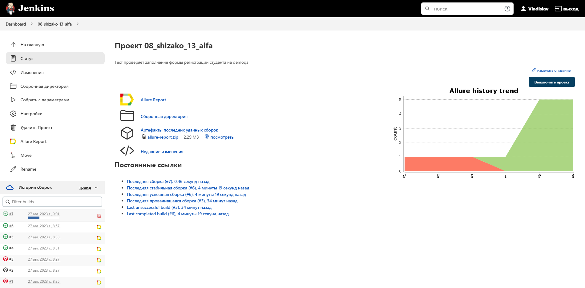

# Автотесты для сайта [Alfabank](https://alfabank.ru)
____
## ⚙️: Стек технологий
<p>
<a href="https://www.java.com/"></a>
<a href="https://www.jetbrains.com/idea/"></a>
<a href="https://gradle.org/"></a>
<a href="https://selenide.org/"></a>
<a href="https://junit.org/junit5/"></a>
<a href="https://aerokube.com/selenoid/"></a>
<a href="https://www.jenkins.io/"></a>
<a href="https://github.com/allure-framework/allure2"></a>
<a href="https://web.telegram.org/"></a>
<a href="https://github.com/"></a>  
<a href="https://qameta.io/"></a>
<a href="https://www.atlassian.com/"></a>  
</p>


---
## :rocket: Запуск автотестов
---
**Команда запуска тестов из терминала**
```
gradle clean test -Dbrowser=chrome -Dversion=99.0 -DbrowserSize=1920x1080
```
---
**Обязательно для использования Selenoid**
+ Создать в папке <code>src/test/resources/config</code> credentials.properties
+ В credentials.properties указать:
  + login=логин от Selenoid
  + password=пароль от Selenoid

##  [Сборка](https://jenkins.autotests.cloud/job/08_shizako_13_alfa/)
**Шаги для запуска тестов:**
1. Зайти в сборку
2. Перейти в раздел <code>Собрать с параметрами</code>
3. Выбрать необходимые параметры
4. Нажать кнопку <code>Собрать</code>

<p align="center">

</p>

___
##  [Пример Allure-отчета](https://jenkins.autotests.cloud/job/08_shizako_13_alfa/17/allure/)


<p align="center">

</p>

___
